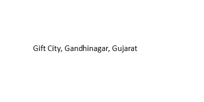
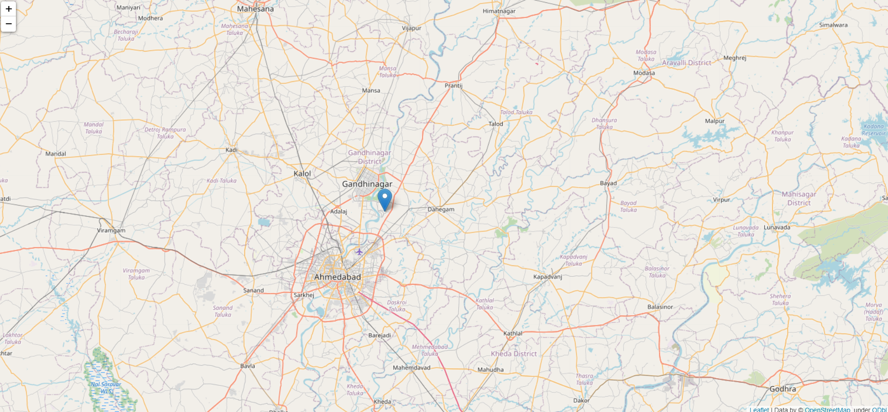
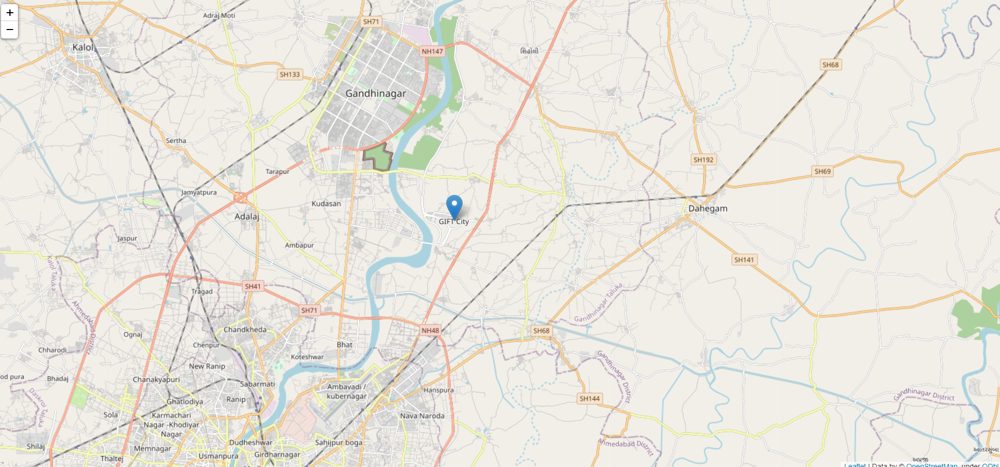
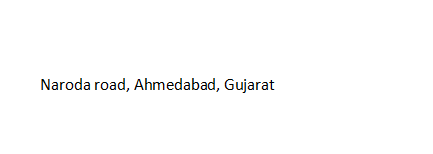

# Finding Address on Google Map

I used the opencv to detect the text from the image. Then using `Google Map API` to find the address on `Google Map`

## First take the image which has "Gift City, Gandhinagar, Gujarat"

### We detect the text using tesseract library after that we give the text to the google api to find the address on map. 

  

